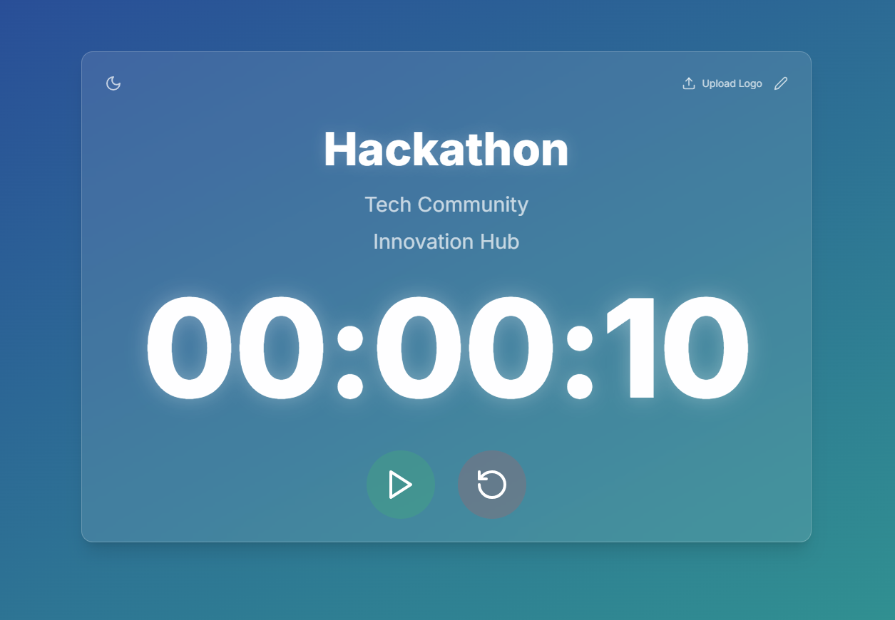

# ⏳ Hackathon Countdown Timer

A customizable countdown timer designed specifically for hackathons, ensuring participants stay on track and aware of their remaining time.

🚀 **Try it now:** [Hackathon Countdown](https://codewithsimon.github.io/hackathon-countdown/)

## ✨ Features

🎯 **Customizable Details:** Add hackathon name, organizer, venue, and an end message.

🖼️ **Hackathon Branding:** Upload a custom logo for personalization.

🎨 **Theme Support:** Switch between light and dark mode for better visibility.

⏯️ **Control Options:** Play, pause, and reset the timer as needed.

🌈 **Custom Colors:** Change the countdown colors to match your theme.


## 📸 Screenshot



## 🛠️ How to Use

🔗 **Online Access**

Use the countdown timer directly via this link: [Hackathon Countdown](https://codewithsimon.github.io/hackathon-countdown/)

🛠️ **Self-Hosting**

Want to customize it further? Fork this repository and modify it as per your needs.

```bash
# Clone the repository
git clone https://github.com/your-username/hackathon-countdown.git

# Navigate into the directory
cd hackathon-countdown

# Install dependencies (if any)
npm install  # or yarn install

# Run locally
npm run dev  # or yarn start

```
***

Contributions and suggestions are always welcome! 🚀

⭐ **If you like this project, please star this repository!** ⭐